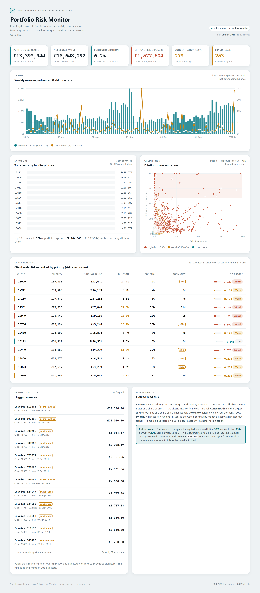

# SME Invoice Finance Risk & Exposure Monitor

Turns real transaction data into invoice-finance risk metrics, fraud flags, and an
early-warning risk scorecard — mirroring the core work of a data analyst at an
invoice finance lender.

## Results

Running the pipeline on the full UCI Online Retail II ledger (**824,364
transactions, 5,942 clients**) produces this dashboard — auto-generated by
`pipeline.py` as a self-contained `outputs/dashboard.html`:



Headline read on the sample portfolio: **£13.4M funding-in-use**, **6.2%**
portfolio dilution, **£1.58M** of exposure sitting in critical-risk clients, and
**253** invoices caught by the fraud rules. The watchlist is ranked by *priority*
(risk score × exposure), so real money at risk floats to the top rather than
dormant £0-balance accounts.

## Business context
An invoice finance lender advances cash against clients' unpaid invoices. The
central question is always "what is our exposure and where is risk building?"
This project answers it across four analyst functions:

| Function            | Metric / output                                            |
|---------------------|------------------------------------------------------------|
| Exposure monitoring | funding-in-use, net ledger value                           |
| Credit risk         | dilution rate, debtor concentration, arrears/dormancy      |
| Early warning       | transparent weighted risk scorecard (client watchlist)     |
| Fraud detection     | round-number & duplicate-invoice anomaly flags             |

## Real data
- **Invoice ledger:** UCI Online Retail II — archive.ics.uci.edu/dataset/502
  (customers = clients, credit-note invoices `C...` = dilution)
- **Default outcomes (optional upgrade):** Lending Club Loan Data (Kaggle) —
  join real `default` labels to fit a *predictive* model on the scorecard's
  features, with `score_clients()` as the explainable baseline to beat.

Framing is adapted (customers->clients, returns->dilution); the numbers are real.

## Run
```
pip install pandas numpy openpyxl
python src/pipeline.py
```
Drop `online_retail_II.xlsx` into `data/` to run on the full ~1M-row dataset;
otherwise a bundled sample runs automatically. Each run also builds a
self-contained `outputs/dashboard.html` — open it in any browser, no server needed.

## Outputs
- `outputs/client_risk_metrics.csv` — per-client exposure & risk metrics
- `outputs/fraud_flags.csv` — flagged suspicious invoices
- `outputs/client_watchlist.csv` — clients scored by the risk scorecard, with a
  `priority` column (risk score × funding-in-use) so the watchlist ranks by money
  actually at risk; per-signal component columns included for auditability
- `outputs/ledger_trend.csv` — weekly invoicing advanced & dilution rate (flow view)
- `outputs/dashboard.html` — interactive risk console over all of the above
  (KPIs, trend, exposure, dilution×concentration, watchlist, fraud), generated
  from `src/dashboard_template.html` with the run's own data embedded

## Next steps
- Add real Lending Club default outcomes and fit a predictive model on the
  scorecard's features — using the transparent scorecard as the baseline to beat
- Enrich clients with real company data via the Companies House API
- Extend the trend from a flow view to true outstanding-balance ageing once
  settlement/payment dates are available
