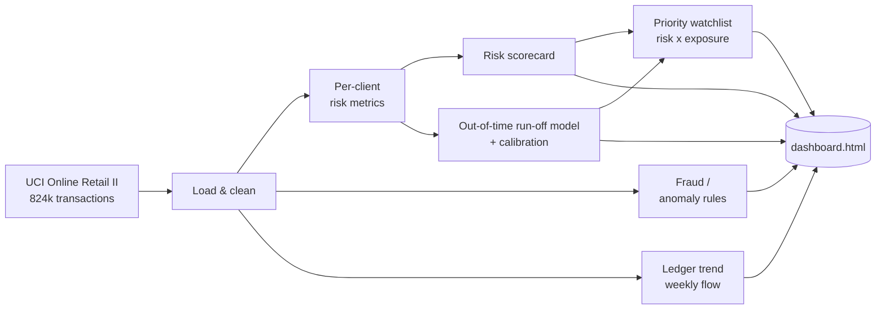

# SME Invoice Finance Risk & Exposure Monitor

> An end-to-end analytics pipeline that turns a real transaction ledger into the
> exposure metrics, fraud flags, and forward-looking early-warning scores that a
> data analyst at an invoice-finance lender produces every day — capped by a
> self-contained, interactive risk dashboard.


📖 **Full write-up:** [How I built this — the story behind the numbers](docs/medium-article.md)

---

## At a glance

- **Scale:** processes the full **824,364-transaction, 5,942-client** UCI Online Retail II ledger in a single run.
- **Four analyst functions in one pipeline:** exposure monitoring, credit risk, early warning, and fraud detection.
- **Two early-warning models:** a transparent, auditable **scorecard** and a **calibrated, out-of-time run-off classifier** — with a deliberately leakage-free design.
- **Actionable, not academic:** the watchlist is ranked by *money at risk* (risk × exposure), and every run ships a browser-ready `dashboard.html` with no server, no build step, and no external dependencies.

---

## Dashboard

Every run regenerates this self-contained console from its own outputs:


---

## The problem

An invoice-finance lender advances cash against a client's unpaid invoices —
typically ~80% up front, collecting the balance when the invoice settles. The
book manager's standing question is always the same:

> **What is our exposure, and where is risk building?**

Three forces erode a lending book, and this project measures all three:

| Risk               | What it means                                              | How it's captured                          |
|--------------------|------------------------------------------------------------|--------------------------------------------|
| **Dilution**       | Clients issue credit notes / returns, shrinking the invoice the lender funded | Credit-note value ÷ gross invoicing |
| **Concentration**  | A client leans on one buyer; lose it and the client fails  | Largest stock line as a share of the ledger |
| **Run-off**        | A client quietly stops trading, stranding live advances    | Predictive out-of-time classifier          |

---

## What it does

| Analyst function     | Output                                                      |
|----------------------|-------------------------------------------------------------|
| Exposure monitoring  | Funding-in-use, net ledger value                            |
| Credit risk          | Dilution rate, debtor concentration, dormancy               |
| Early warning        | Risk scorecard **+** out-of-time run-off model → priority watchlist |
| Fraud detection      | Round-number & duplicate-invoice anomaly flags              |

---

## How it works

A single, readable pipeline (`src/pipeline.py`) runs top to bottom and emits every artifact:



**Engineered to scale:** the debtor-concentration metric is fully vectorised
(a `max/sum` over per-client stock-line totals) rather than a per-group Python
apply, so it runs over the ~1M-row ledger without falling over.

---

## Early warning: two complementary models

**1. Risk scorecard** (`score_clients`) — a transparent, weighted blend of the
three core signals (dilution 50%, concentration 25%, dormancy 25%), each
normalised to `0–1`. It's a documented *rule*, not a trained model, so it's fully
auditable and leakage-free by construction — exactly how a real credit scorecard
works. It stays in the system as the **explainable baseline to beat**.

**2. Predictive run-off model** (`train_default_model`) — an **out-of-time**
`RandomForest`:

- **Features:** client behaviour strictly *before* a cutoff date.
- **Label:** the client goes into run-off (stops invoicing) in the window *after* it.
- **Validation:** a 25% hold-out gives an honest AUC; the scorecard is scored on
  the same forward label as the baseline.
- **Calibration:** probabilities are passed through `CalibratedClassifierCV`
  (isotonic by default, Platt optional) so `P(run-off)` reads as a **true
  probability**, not just a ranking. Because calibration is monotonic, it corrects
  the probability scale while leaving the AUC intact — the run reports the **Brier
  score before vs after** as proof.
- **Deployment:** the model is refit on all history and **scored forward** onto
  every current client, producing the `P(run-off)` column and
  `forward_watchlist.csv`, ranked by *expected exposure at risk* (`probability × funding`).

> **Why not bolt on an external default dataset (e.g. Lending Club)?** Its loan
> outcomes share no join key with these retail clients — attaching them would be
> *inventing* labels. Instead the model learns from the ledger's own forward
> outcomes: genuinely predictive, and leakage-free because the label lives
> strictly in the future.

---

## Results

Running on the full ledger (**824,364 transactions · 5,942 clients**):

**Portfolio exposure & risk**

| Metric                                    | Value      |
|-------------------------------------------|------------|
| Funding-in-use                            | **£13.4M** |
| Portfolio dilution                        | **6.2%**   |
| Exposure in critical-risk clients         | **£1.58M** |
| Invoices caught by fraud rules            | **253**    |

**Predictive run-off model**

| Metric                                    | Value                    |
|-------------------------------------------|--------------------------|
| Hold-out AUC (model)                      | **0.78**                 |
| Hold-out AUC (scorecard baseline)         | 0.73                     |
| Brier score (before → after calibration)  | 0.1845 → **0.1816**      |
| Current clients scored forward            | **4,477**                |
| Flagged at `P(run-off) ≥ 0.5`             | 1,739                    |
| Expected exposure at risk (next ~6 months)| **~£2.1M**               |

An AUC of 0.78 is *realistic, not suspiciously perfect* — which is the point: the
forward-looking label leaves no room for leakage. And the forward ranking
genuinely differs from the scorecard, because it predicts who will **run off next**
rather than who merely looks risky today.

---

## Tech stack

| Layer            | Tooling                                                        |
|------------------|---------------------------------------------------------------|
| Language         | Python 3.11                                                    |
| Data & compute   | pandas, NumPy (vectorised metrics)                             |
| Modelling        | scikit-learn — `RandomForestClassifier` + `CalibratedClassifierCV` |
| Ingestion        | openpyxl (Excel ledger)                                        |
| Reporting        | Self-contained HTML / CSS / vanilla JS dashboard (no framework, no server) |
| Testing          | pytest                                                         |

---

## Project structure

```
invoice_finance_project/
├── src/
│   ├── pipeline.py              # the full pipeline: load → metrics → fraud → models → dashboard
│   └── dashboard_template.html  # HTML shell; the run injects its own data at __DATA__
├── tests/
│   └── test_pipeline.py         # 11 pytest cases over metrics, fraud, scorecard, trend & model
├── data/                        # full .xlsx ledger + a bundled CSV sample fallback
├── outputs/                     # generated CSVs + dashboard.html
├── docs/                        # write-up + dashboard screenshot
├── requirements.txt
└── README.md
```

---

## Quickstart

```bash
pip install -r requirements.txt
python src/pipeline.py
```

Drop `online_retail_II.xlsx` into `data/` to run on the full ~1M-row dataset;
otherwise a **bundled sample runs automatically**, so the pipeline works out of
the box. Every run writes a self-contained `outputs/dashboard.html` — open it in
any browser, no server needed.

## Tests

The suite runs on small, hand-built synthetic ledgers, so the expected numbers are
verifiable by hand and no large dataset is required:

```bash
pip install pytest
pytest -q          # 11 passing
```

Coverage: metric maths, fraud rules, the scorecard (including cap saturation),
the ledger trend, and the calibrated run-off model (valid probabilities,
exposure bounds, finite Brier score).

---

## Outputs

| File                                | Contents                                                                    |
|-------------------------------------|-----------------------------------------------------------------------------|
| `outputs/client_risk_metrics.csv`   | Per-client exposure & risk metrics                                          |
| `outputs/fraud_flags.csv`           | Flagged suspicious invoices                                                 |
| `outputs/client_watchlist.csv`      | Scorecard-ranked clients with a `priority` column (risk × funding) and per-signal components for auditability |
| `outputs/ledger_trend.csv`          | Weekly invoicing advanced & dilution rate (flow view)                      |
| `outputs/default_model.csv`         | Historical training population: forward run-off label, predicted probability, hold-out flag |
| `outputs/forward_watchlist.csv`     | Current clients scored by the deployed model: `P(run-off)` and expected exposure at risk |
| `outputs/dashboard.html`            | Interactive risk console over all of the above — KPIs, trend, exposure, dilution × concentration, watchlist, model validation, and fraud |

---

## Design decisions worth calling out

- **Leakage-free by design.** The predictive label is strictly forward-looking;
  the scorecard is a pure rule. Nothing the model sees at training time comes
  from the future it's predicting.
- **Ranked by money, not just risk.** A maxed-out risk score on a client with £0
  advanced is a note, not an action. `priority = risk × funding-in-use` floats
  real exposure to the top of the watchlist.
- **Calibrated probabilities.** `P(run-off)` is a genuine probability, reported
  with a Brier-score check — not an uncalibrated model score dressed up as one.
- **Honest, reproducible framing.** The retail data is re-lensed as a lending
  book (customers → clients, credit notes → dilution); the *numbers are real* and
  the adaptation is stated plainly, never hidden.

---

## Roadmap

- **Temporal cross-validation** across multiple cutoff dates (probability
  calibration is already in — see the model section).
- **Company enrichment** via the Companies House API for real firmographic risk signals.
- **True balance ageing** — extend the trend from a flow view to outstanding-balance
  ageing once settlement/payment dates are available.

---

## Data & attribution

- **Invoice ledger:** [UCI Online Retail II](https://archive.ics.uci.edu/dataset/502)
  — a real UK online-retail transaction dataset. Customers are treated as
  *clients* and credit-note invoices (`C…`) as *dilution*. The framing is adapted
  for the invoice-finance context; the underlying figures are unchanged.
